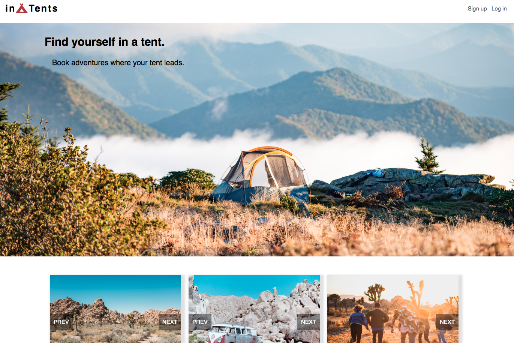

# in-Tents
---

in-Tents, a HipCamp clone, is a campsite booking application that allows users to book campsites hosted by other users.

[Live Demo](https://in-tent.herokuapp.com/#/)

## Technologies

#### Backend: 
* Ruby on Rails
* ActiveRecord
* PostgreSQL
* Amazon Web Services

#### Frontend: 
* React
* Redux
* Webpack
* Babel
* W3 CSS Animate
* SCSS

## Features
* Secure frontend to backend user authentication using BCrypt
   * Users can sign up, log in, and log in as a Demo user to browse the site
* Users can view a list of camping spots available
* The list of camping sites display a carousel of pictures to preview
* Users can view more details for a camping spot
* After viewing a spot, users can create a booking by picking a check-in and check-out date on the calendar and inputting the number of guests.
* Bookings are listed on the user's profile page, where the user can choose to cancel a booking.

### Demo User Login

## Possible future features

In the future I would like to add:
  * Map with Markers
  * Search
  * Users can create a spot
  * Bookings can be edited
  * Users can post, edit, and delete reviews